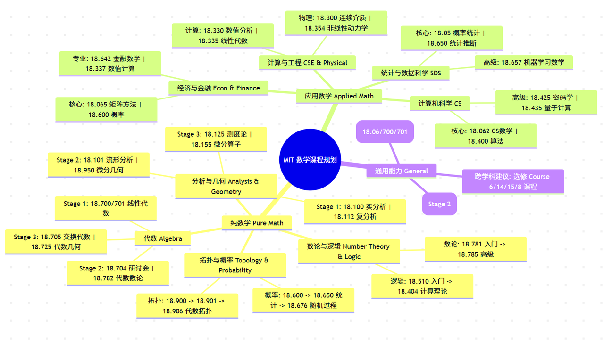

# 学习帮助

> 宇宙间之事理无穷，科学领土内之膏腴待辟者，正自广阔。青年勉乎哉！——陈独秀

<u>**关于链接访问不了，请阅读这篇**</u><u>**飞书文档**</u><u>**的相关部分。**</u>

[CS50 - 资源总目录](https://uufyjevghz.feishu.cn/docx/DP78d2U5TosTOTx9QCbcjp8GnBh)

**注：现在很多网课已经搬运到 b 站了。**

> MIT 的数学学习路线：[Math Major Roadmaps](https://math.mit.edu/academics/undergrad/roadmaps.html)，如图所示。

## 百科性质

1. [CS 自学指南](https://csdiy.wiki/) 北京大学的学生撰写的一本关于自学 CS 的书，可以说是我自学的开端，对我帮助非常大。我当时是在大一的下学期接触到的，希望以后的学生能够在大学伊始就能接触到最先进的教育模式。
2. [THU Stat Wiki](https://thu-stat-wiki.github.io/) 清华大学统计百科。
3. [清华软件学院互助文档](https://ssast-readme.github.io/)
4. [统计学自学指南](https://xuankaiwang.github.io/) 互联网上的优质内容，恰好匹配所学专业。
5. [浙江大学课程攻略共享计划](https://github.com/QSCTech/zju-icicles) 这是国内大学里面最为典型的样例，除此之外还有很多大学的学生自发组织了这样的计划。客观来讲，我们学校距离这些大学还有差距，尽管国内的高等教育为师生所诟病，但是国内优秀大学的学生还是会自己想办法来解决这些问题。长此以往，每一届学生都可以站在前人的肩膀上，省去了很多本不必要浪费的时间和精力。想要看更多大学的相关内容参考[大学课程共享计划整理](https://github.com/mewcoder/SharedCourses?tab=readme-ov-file)。
6. [未央学习](https://weiyangxuexi.github.io/)
7. [HDU-CS-Wiki](https://hdu-cs.wiki/) 杭州电子科技大学 CS Wiki。
8. [Linux 101](https://101.lug.ustc.edu.cn/) 中国科学技术大学的 Linux 讲义。我学习 Linux 的时候就是依据这个来学的。
9. [南科大飞跃手册](https://sustech-application.com/)
10. [SAST skill docs](https://docs.net9.org/) 清华计算机系学生科协技能引导文档。
11. [OSSU Math](https://github.com/ossu/math) Open Source Society University 的数学教育。
12. [可汗学院](https://www.khanacademy.org/) 全科教育。
13. [Roadmap](https://roadmap.sh/) 开发者路线图集合。

## 官方/参考文档

1. [NumPy 官方文档](https://numpy.org/)
2. [Pandas User Guide ](https://pandas.pydata.org/docs/user_guide/index.html#user-guide)
3. [Matplotlib 官方文档](https://matplotlib.org/)
4. [Pyecharts 官方文档](https://gallery.pyecharts.org/#/) 中文的，非常友好。
5. [Seaborn 官方文档](https://seaborn.pydata.org/)
6. [Python3 官方文档](https://docs.python.org/zh-cn/3/)
7. [OpenCV 的社区版中文文档](https://opencv.apachecn.org/#google_vignette)
8. [数据分析资料库](https://larkcommunity.feishu.cn/wiki/T3TXwE2VXi9FBUk5ywockbPhnBb)  一个飞书的优质知识库，里面较为系统的梳理了数据分析知识。
9. [C++ 参考手册](https://en.cppreference.com/w/)
10. [Vue 的官方文档](https://cn.vuejs.org/)
11. [React 的官方文档](https://zh-hans.react.dev/)

## 学术论文

1. [Sci-Hub](https://sci-hub.se/) 旨在打破知识垄断的革命性网站。
2. [arXiv](https://arxiv.org/) 涵盖数理领域的论文平台。
3. [Google Scholar](https://scholar.google.com/) 全世界最大的学术平台。
4. [Zotero](https://www.zotero.org/) 学术论文管理工具。

## 平台和社区

1. [知乎](https://www.zhihu.com/) 中文问答社区，国内少数的图文平台。
2. [博客园](https://www.cnblogs.com/) 中文博客平台。
3. [Kaggle](https://www.kaggle.com) 全球知名数据科学平台，高水平选手可以组队参加其中的比赛。
4. [和鲸社区](https://www.heywhale.com/home) 国内的数据科学平台。
5. [Github](https://github.com/) 全球知名的开源平台，充满了各种学习资源。
6. [Gitee](https://gitee.com/) 国内开源平台。
7. [少数派](https://sspai.com/?utm_source=itab.ink) 知名社区。
8. [稀土掘金](https://juejin.cn/) 知名开发社区。
9. [Reddit](https://www.reddit.com/) 国际网络社区。
10. [Top.AI](https://topd.tencent.com/ai?ref=itab.link) 腾讯的开放设计平台。

## 实用网站

1. [excalidraw](https://excalidraw.com/) 手绘风画图工具。
2. [draw.io](https://app.diagrams.net/) 在线绘图网站。
3. [carbon](https://carbon.now.sh/?bg=rgba%28171%2C184%2C195%2C100%29&t=seti&wt=none&l=auto&width=680&ds=true&dsyoff=20px&dsblur=68px&wc=true&wa=true&pv=48px&ph=32px&ln=false&fl=1&fm=Hack&fs=13px&lh=133%25&si=false&es=2x&wm=false&code=) 代码块美化工具。
4. [uTools](https://www.u-tools.cn/index.html?from=itab) 优质插件集合。
5. [oeis](https://oeis.org/?language=chineseS) 整数数列大全。
6. [geogebra desmos](https://www.desmos.com/calculator?lang=zh-CN) 解析几何画图工具。
7. [软站](https://rzhan.cc/) 软件集合。
8. [BlogFinder](https://bf.zzxworld.com/s) 搜集个人 Blog 的网站。
9. [sqlzoo](https://sqlzoo.net/wiki/SQL_Tutorial) 在线练习 sql 语句。
10. [Hello Github](https://hellogithub.com/) 介绍 Github 里面优质项目的网站。

## 关于笔记

> [!TIP]
> 请不要被「语法」二字吓倒！Markdown 完全可以被迅速掌握，或许你在掌握它后，会有知之恨晚之感，并迫不及待地把它应用到日常的学习和工作之中！
> 
> LaTex 虽然相对于 Markdown 稍显复杂，但是作为学数学的人，你是必须要会的。而且客观而言也并不困难

### 基本要求

1. 熟练掌握 [Markdown ](https://markdown.com.cn/) 和 LaTex 语法。
2. 使用电脑上的笔记软件：飞书、语雀、思源、FlowUS、ima、Notion、Obsidian、Typora 等均可。如果你是 MacOS，可以使用[妙言](https://miaoyan.app/)。
3. 可以通过 [keybr](https://www.keybr.com/) 练习盲打。
4. 虽然对于学数学的来说不是必须，但强烈建议学习 [Git](https://git-scm.com/book/zh/v2/%E8%B5%B7%E6%AD%A5-%E5%AE%89%E8%A3%85-Git)。

### 进阶选择

**希望你能在阅读完这篇文章后，理解 AI 时代的学习方式，不要再使用落后的学习模式了！**

**日常工作学习流：**
<iframe
src="https://sspai.com/post/75969" 
  width="100%" 
  height="400" 
  style="border:1px solid #eee; border-radius: 8px;">
</iframe>

但我**不建议**没有前端基础的使用 Obsidian。